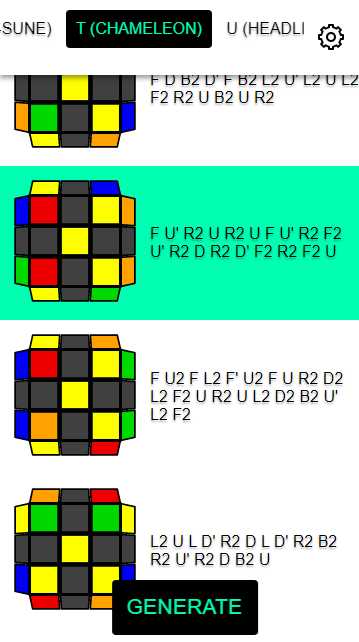

# CxLL Trainer

A simple CxLL trainer

<kbd></kbd>

## Features:

Optimized for mobile.

You can choose random orientation or your own for each corner case on the options menu.

Click on a case to make it green. Can help track the one you're solving.

## Issues:

It may take a good while to load, please be patient. [Now it has a loader :)]

Close button on menu can be glitchy.

https://shuantsu.github.io/cxll/
